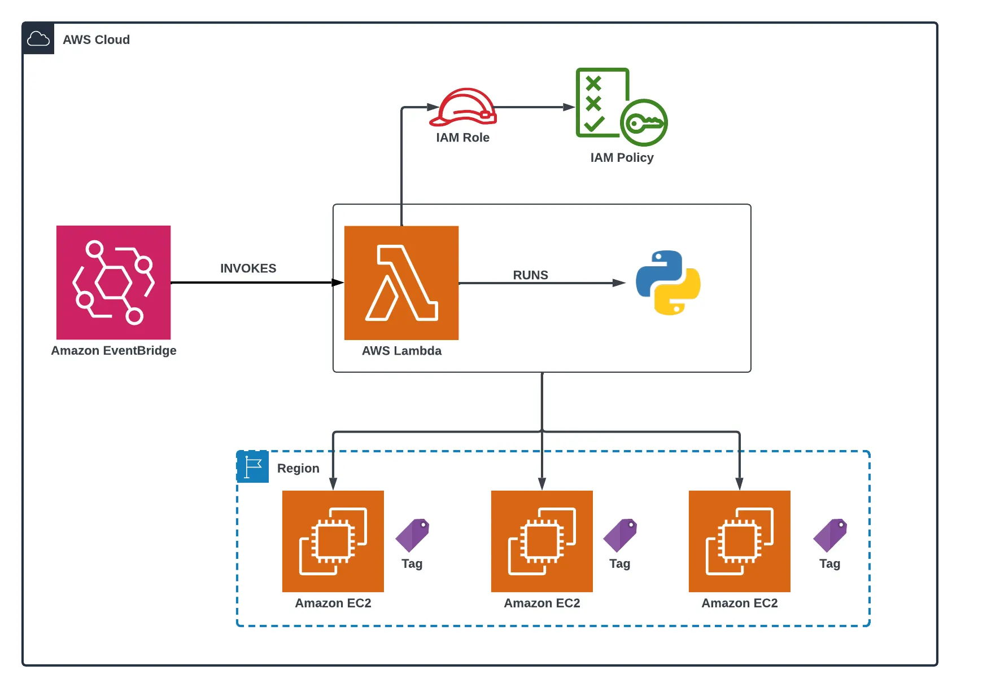

# 🧩 AWS Lambda EC2 Automation

This repository contains **AWS Lambda functions** to automate the **lifecycle management of EC2 instances** in the **Mumbai (`ap-south-1`) region**.  
It includes functions to **🚀 Launch**, **▶️ Start**, **⏹️ Stop**, and **🗑️ Terminate** EC2 instances.  
- **Start** and **Stop** operations are scheduled using **Amazon EventBridge cron rules**.  
- **Launch** and **Terminate** operations are triggered **manually**.

---

## 🖼️ Architecture Diagram

*The diagram above illustrates how Lambda functions interact with Amazon EC2 and EventBridge to automate lifecycle operations.*

---

## ⚙️ Lambda Functions Overview

| ⚡ Function | 🧠 Purpose | ⏰ Trigger | 📄 Description |
|-------------|------------|------------|----------------|
| **🚀 Launch EC2** | Launch a new EC2 instance | Manual | Launches a `t2.micro` EC2 instance with a specified AMI, key pair, subnet, and security group. |
| **▶️ Start EC2** | Start a stopped EC2 instance | EventBridge `cron(30 4 * * ? *)` → 10:00 AM IST | Automatically starts the EC2 instance at the start of the workday. |
| **⏹️ Stop EC2** | Stop a running EC2 instance | EventBridge `cron(30 12 * * ? *)` → 06:00 PM IST | Stops the EC2 instance to optimize cost. |
| **🗑️ Terminate EC2** | Terminate an EC2 instance | Manual | Permanently deletes the EC2 instance from your AWS environment. |

> ⚠️ **Note:** Cron expressions are in **UTC**.  
> Example conversions:  
> 🕙 10:00 AM IST = 4:30 AM UTC → `cron(30 4 * * ? *)`  
> 🌆 06:00 PM IST = 12:30 PM UTC → `cron(30 12 * * ? *)`

---

## 🧰 Tech Stack

- 🐍 **AWS Lambda** (Python 3.13)  
- 💻 **Amazon EC2**  
- ⏰ **Amazon EventBridge** (CloudWatch cron)  
- 🔐 **IAM Roles & Policies**  
- 📊 **CloudWatch Logs**

---

## 🧠 Prerequisites

Before deployment, ensure the following:
- ✅ AWS account with **Lambda** and **EC2** access.
- ✅ IAM Role attached to the Lambda functions with permissions to:
  - Launch, Start, Stop, and Terminate EC2 instances.
  - Describe EC2 instances and create tags.

---

## 🚀 Deployment Steps

### 1️⃣ Create Lambda Functions
- Go to **AWS Lambda → Create Function**
- Runtime: **Python 3.13**
- Copy and paste each Python script (`launch`, `start`, `stop`, `terminate`)
- Region: **ap-south-1**
- Assign an IAM Role with the required EC2 permissions

---

### 2️⃣ Configure EventBridge Rules (for Start & Stop)
- Navigate to **Amazon EventBridge → Rules → Create rule**
- Select **Schedule → Cron expression**
- Attach the corresponding Lambda function as the **Target**
- Enable the rule

---

### 3️⃣ Manual Triggers
- **Launch** and **Terminate** Lambda functions can be invoked manually via:
  - 🧩 **Lambda Console → Test** (provide input if required)
  
    
    
  - 💻 **EC2 Console**
  
    

---

## 🔍 Monitoring

- 📜 Execution logs for each Lambda function are captured in **Amazon CloudWatch Logs**.  
- 📢 Optionally, set up **CloudWatch Alarms** or **SNS notifications** to receive alerts on execution success or failure.

---

## 🧱 Use Cases

- 🌅 **Auto-start EC2 instances** each morning and **auto-stop** in the evening.  
- 💰 **Save AWS costs** by stopping unused instances during non-working hours.  
- 🧪 Quickly **launch and terminate** dev/test environments on demand.  
- 🔁 Integrate into **CI/CD pipelines** for dynamic infrastructure provisioning.

---

✨ _Designed and implemented to simplify EC2 management, reduce costs, and enhance automation for DevOps workflows._
